# Grad-CAM Analysis of ConvNeXt Models

## Overview

This repository contains the analysis and results of a Grad-CAM study performed on a subset of 70 patients, utilizing approximately 200 images. The analysis focuses on five ConvNeXt models trained on five specific labels. Grad-CAM was run on the images corresponding model of the  label.

## Dataset

- **Patients:** 70
- **Total Images:** ~200
- **Labels:** 5 (specific to the study)

## Methodology

The Grad-CAM (Gradient-weighted Class Activation Mapping) technique was used to visualize the areas of the input images that were significant for model predictions. The analysis was conducted on the rows where labels were present, using the corresponding ConvNeXt model associated with each label.

### Grad-CAM Implementation

1. **Model Selection:** For each labeled image, the specific ConvNeXt model trained on that label was used.
2. **Grad-CAM Execution:** Grad-CAM was applied to generate heatmaps that indicate which parts of the image contributed most to the model's predictions.

## Color Scale

The color scale used in the Grad-CAM visualizations ranges from low to high activation, represented by the following color gradient:

- **Low Activation:** Blue
- **Medium Activation:** Yellow
- **High Activation:** Red

This gradient allows for easy interpretation of which areas of the image are being emphasized by the model.

## Example Results

Here are links to specific Grad-CAM images generated during the analysis:

### AP
- 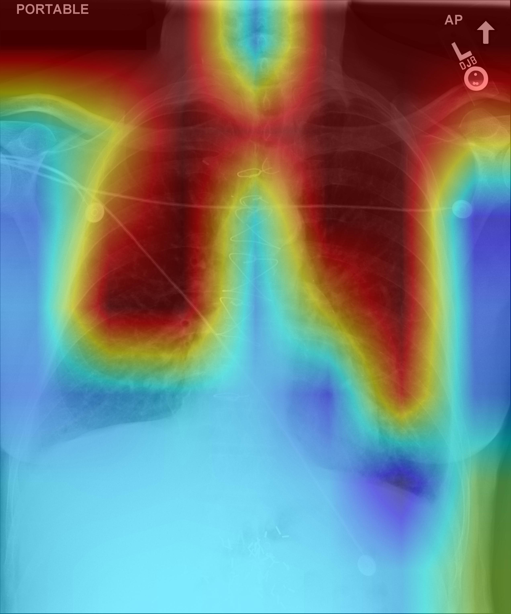
- 
- 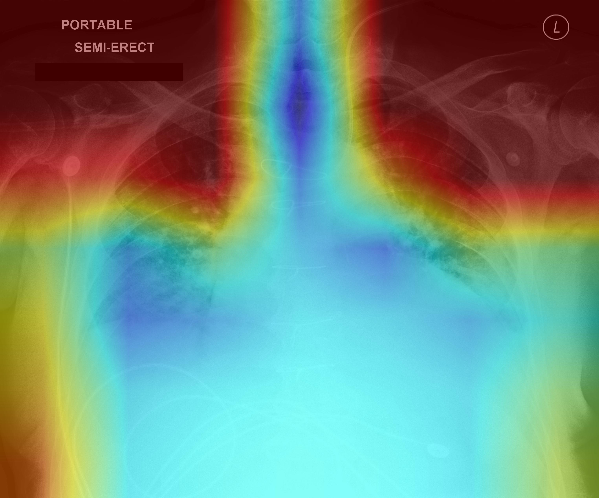
### Lateral
- 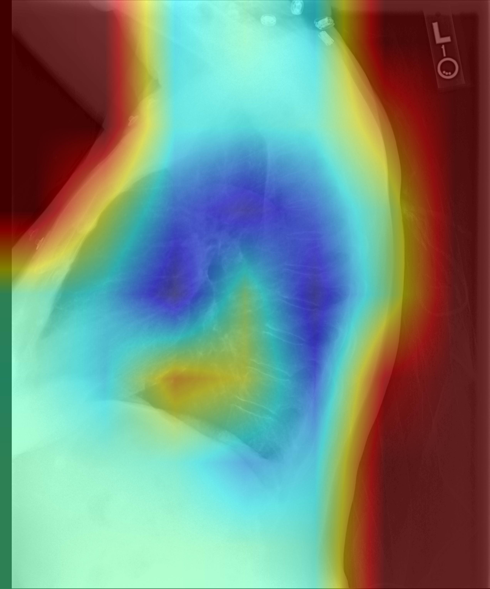
- 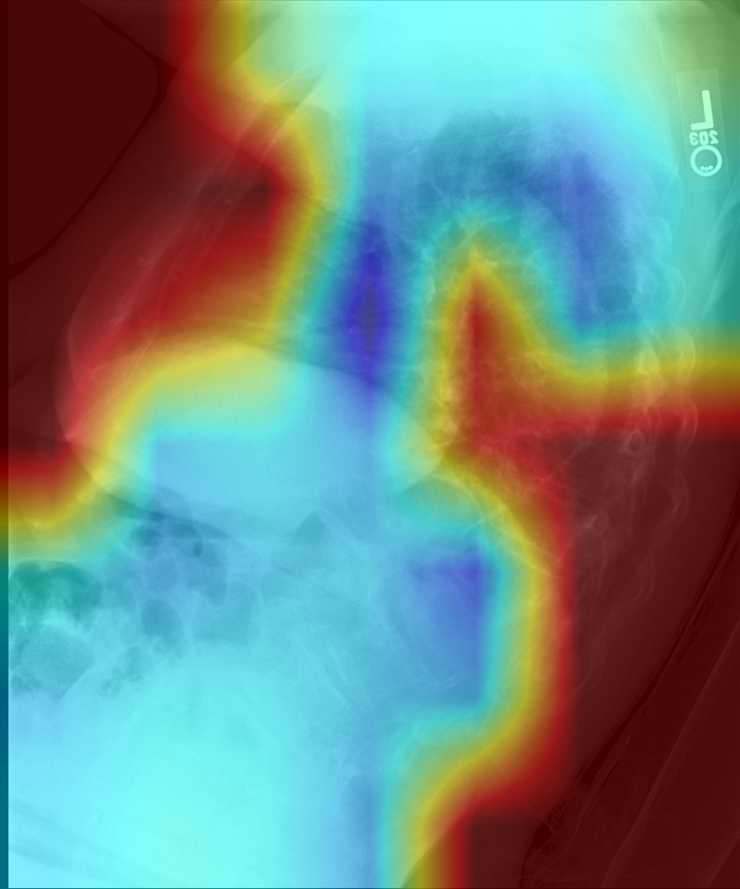
- 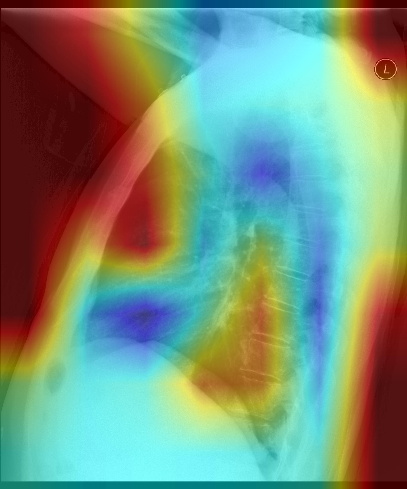
### LL
- 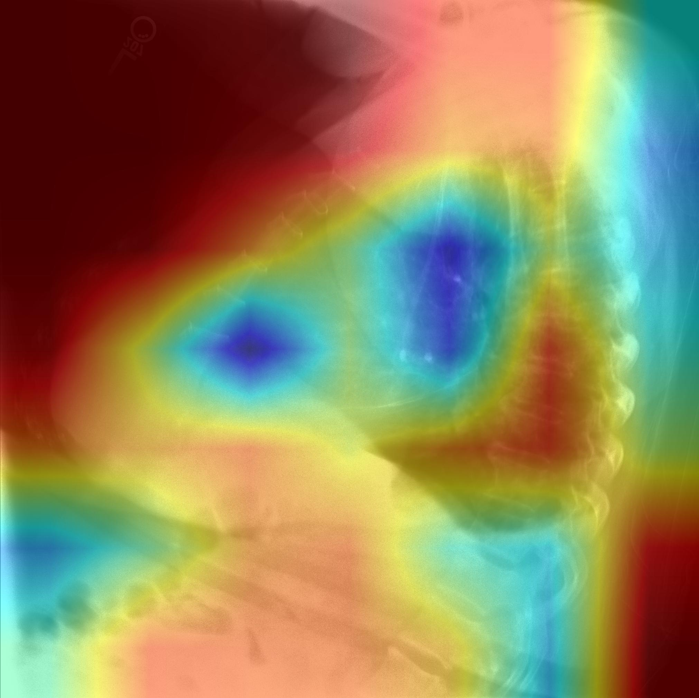
- 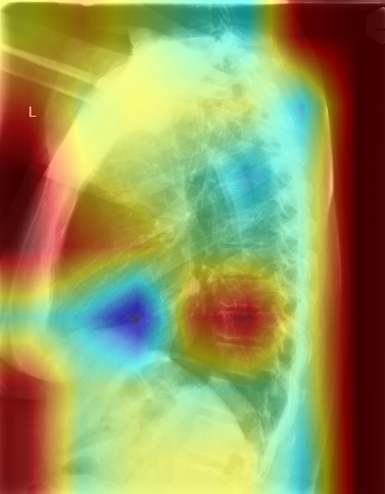
- 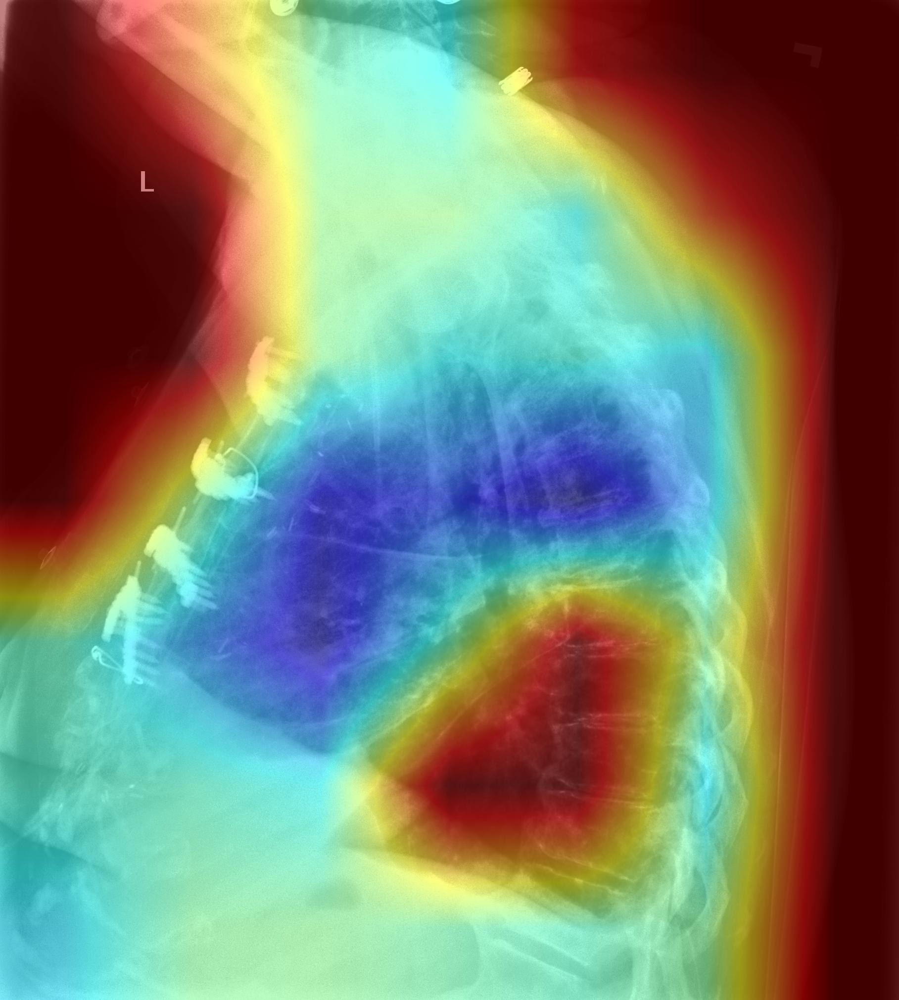
### PA
- 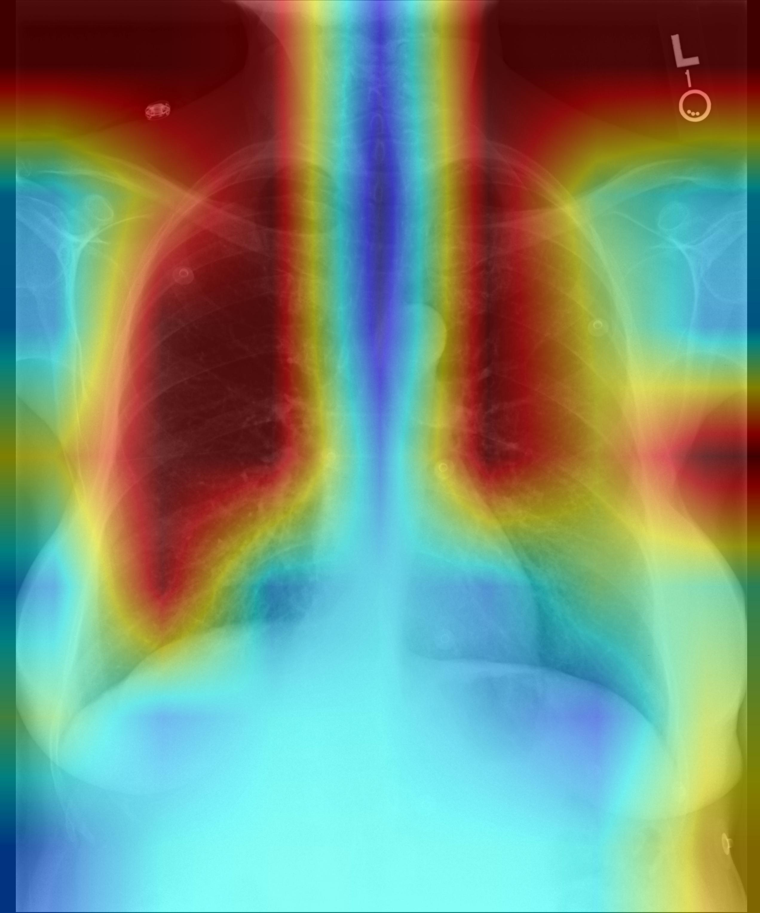
- 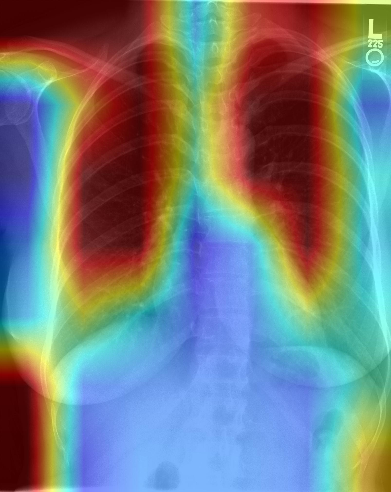
- 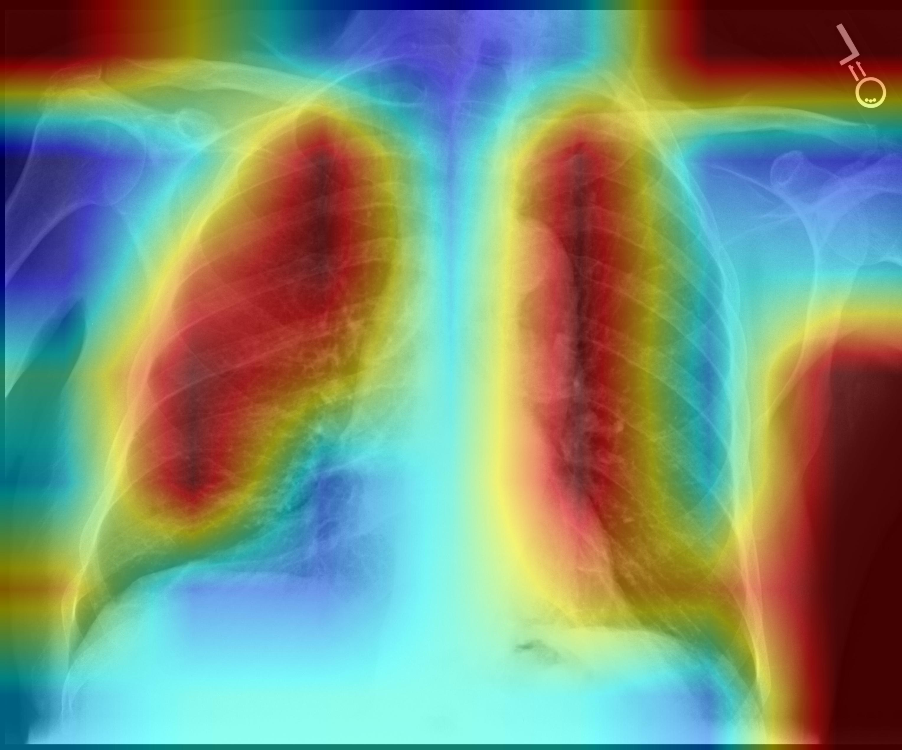

## Conclusion

The analysis revealed that the ConvNeXt models tend to emphasize the borders of the images significantly. This tendency suggests that the models may be relying on specific viewpoints as shortcuts for prediction.

